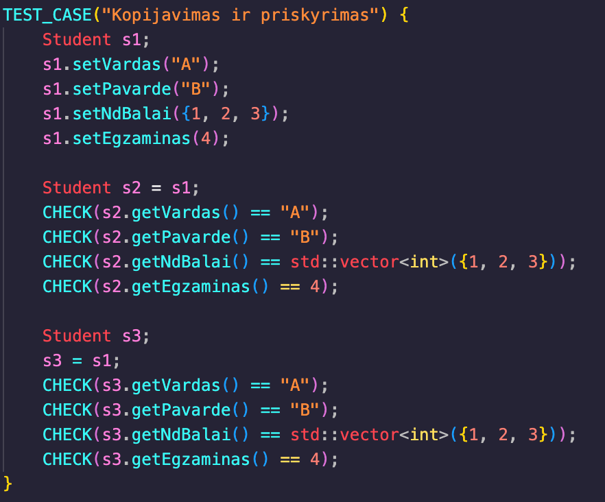

# OOP

# Trečiasis darbas – `Vector<T>` klasė (std::vector alternatyva)

## Aprašymas

Šio darbo metu buvo sukurta šabloninė `Vector<T>` klasė, kuri veikia kaip `std::vector` alternatyva. Klasė palaiko dinaminių duomenų saugojimą ir automatizuotą atminties paskirstymą. Ji naudota studentų valdymo programoje vietoje STL `std::vector`, taip užtikrinant, kad programos funkcionalumas išlieka, o kartu įgyjama daugiau supratimo apie konteinerių veikimą.

Klasė palaiko šabloninius tipus, todėl veikia tiek su `int`, `double`, tiek su naudotojo sukurtais tipais, pvz., `Student`.

## Naudojimas projekte

```cpp
#include "vektorius.h"

Vector<Student> studentai;
studentai.push_back(Student("Vardenis", "Pavardenis", 8, 9));
```

Vietoj std::vector<Student> naudojamas Vector<Student>, todėl visos funkcijos kaip nuskaitytiStudentus, rikiuoti, spausdinti ir pan. veikia su šiuo konteineriu.


## 1. push_back(const T&)
Paskirtis: Prideda naują elementą į vektoriaus pabaigą. Jei reikia – automatiškai padidina talpą.
Pavyzdys:
```cpp
Vector<int> skaiciai;
skaiciai.push_back(10);
skaiciai.push_back(20);
// Dabar vektorius turi du elementus: [10, 20]
```

## 2. operator[](size_t)
Paskirtis: Prieiga prie elemento pagal indeksą (nesaugiai, be ribų tikrinimo).
Pavyzdys:
```cpp
int pirmas = skaiciai[0]; // pirmas = 10
skaiciai[1] = 99;         // antras elementas pakeičiamas į 99
```

## 3. resize(size_t, const T&)
Paskirtis: Pakeičia vektoriaus dydį. Jei didėja – nauji elementai užpildomi nurodyta reikšme.
Pavyzdys:
```cpp
skaiciai.resize(5, -1);
// Dabar turime: [10, 99, -1, -1, -1]
```
## 4. operator= (kopijavimo ir perkėlimo)
Paskirtis: Priskiria vieną Vector kitam – tiek kopijuojant, tiek perkeliant (move).
Pavyzdys:
```cpp
Vector<int> a = skaiciai;       // Kopijuoja skaiciai į a
Vector<int> b = std::move(a);   // Perkelia a į b
```

## 5. begin() ir end()
Paskirtis: Grąžina rodykles į pirmą ir paskutinį elementus – naudojama iteravimui.
Pavyzdys:
```cpp
for (auto it = skaiciai.begin(); it != skaiciai.end(); ++it) {
    std::cout << *it << " ";
}
// Rezultatas: 10 99 -1 -1 -1
```
---
**Kas buvo pridėta:**

- Iškart po kiekvieno aprašymo yra pavyzdžiai, kurie demonstruoja, kaip naudoti funkcijas.
- Pavyzdžiai susiję su `Vector` klasės funkcijomis, pvz., `push_back()`, `operator[]`, `resize()`, `operator=`, ir `begin() / end()`.

## FAILŲ TYRIMŲ REZULTATAI `std::vector` ir `Vector<T>`:


|        FAILAS          |       std::vector #3ST          |     Vector<T> #3ST    |
|------------------------|---------------------------------|------------------------
| Gstudentai100000.txt   |            0.197912             |       0.18405         |
| Gstudentai1000000.txt  |            1.80717              |       1.54891         |
| Gstudentai10000000.txt |            17.8956              |       17.0197         |


## Diegimo instrukcija

1. **Atsisiųsk `Kursiokai.dmg` failą**.
2. Dukart spustelėk `.dmg` failą – jis atsidarys kaip virtualus diskas.
3. Viduje pamatysi aplikaciją `Kursiokai.app`.
4. **Nutempk `Kursiokai.app` į `~/Applications/VU/Vardenis-Pavardenis/`** arba bet kur kitur.
5. Dukart spustelėk `Kursiokai.app` – terminalas turėtų atsidaryti ir paleisti programą.

---


## Projekto aprašymas su abstračia klasę

Šis projektas yra skirtas objektinio programavimo principų demonstravimui, naudojant abstrakčią bazinę klasę `Zmogus` ir iš jos išvestinę klasę `Studentas`. Projektas apima įvairias funkcijas, tokias kaip duomenų įvedimas, apdorojimas, rūšiavimas ir testavimas.

## Funkcionalumas su abstrakčia klasę

1. **Abstrakti bazinė klasė `Zmogus`**:
   - Aprašo bendras žmogaus savybes: vardą ir pavardę.
   - Turi grynai virtualią funkciją `spausdintiInformacija`, kurią įgyvendina išvestinės klasės.

2. **Išvestinė klasė `Studentas`**:
   - Paveldi `Zmogus` klasę ir prideda papildomas savybes: namų darbų pažymius ir egzamino rezultatą.
   - Implementuoja funkcijas:
     - Vidurkio ir medianos skaičiavimas.
     - Galutinio pažymio skaičiavimas.
     - Duomenų išvedimas naudojant perdengtą `operator<<`.

3. **Duomenų įvedimas**:
   - Rankinė įvestis per konsolę.
   - Automatinė įvestis naudojant atsitiktinių duomenų generavimą.
   - Įvestis iš failo, kurio formatas turi būti tinkamai struktūruotas.

4. **Testavimas**:
   - Naudojama `doctest` biblioteka, kuri tikrina:
     - Konstruktorius ir destruktorius.
     - Kopijavimo ir perkėlimo operatorius (Rule of Five).
     - Vidurkio, medianos ir galutinio pažymio skaičiavimą.
     - Abstrakčios klasės funkcionalumą.

5. **Failų apdorojimas**:
   - Studentai rūšiuojami į „vargšiukus“ ir „kietiakus“ pagal jų galutinį pažymį.
   - Rezultatai išsaugomi atskiruose failuose.


## Testavimo rezultatai

- Testai atlikti naudojant `doctest` biblioteką.
- Tikrinamos šios funkcijos:
  - Konstruktoriai ir destruktoriai.
  - Kopijavimo ir perkėlimo operatoriai.
  - Vidurkio, medianos ir galutinio pažymio skaičiavimas.
  - Abstrakčios klasės funkcionalumas.


## Abstraktumo įrodymas


## Perdengtų metodų aprašymas

Šiame projekte naudojami perdengti metodai, kurie leidžia patogiai dirbti su studentų duomenimis.

### Duomenų įvestis

1. **Rankinė įvestis**:
   - Naudojamas perdengtas `operator>>` metodas, kuris leidžia patogiai įvesti studento duomenis iš standartinio įvesties srauto.
   - Įvedimo metu tikrinama, ar vardas ir pavardė sudaryti tik iš raidžių, o pažymiai ir egzamino rezultatas yra tinkamo intervalo (0–10).
   - Pavyzdys:
     ```
     Įveskite studento vardą: Jonas
     Įveskite studento pavardę: Jonaitis
     Įveskite namų darbų pažymius (baigti - ne skaičius): 8 9 10
     Įveskite egzamino pažymį: 9
     ```

2. **Automatinė įvestis**:
   - Naudojama funkcija `generuotiStudentus`, kuri automatiškai sugeneruoja nurodytą kiekį studentų su atsitiktiniais vardais, pavardėmis, pažymiais ir egzamino rezultatais.
   - Pavyzdys:
     ```cpp
     std::vector<Student> studentai = generuotiStudentus(100);
     ```

3. **Įvestis iš failo**:
   - Naudojama funkcija `nuskaitytiStudentus`, kuri skaito studentų duomenis iš failo. Failo formatas turi atitikti numatytą struktūrą (vardas, pavardė, pažymiai, egzaminas).
   - Pavyzdys:
     ```
     Jonas Jonaitis 8 9 10 9
     Petras Petraitis 7 8 6 8
     ```
### Papildoma informacija

- **Destruktorius**:
  - `Student::~Student` užtikrina, kad visi dinaminiai resursai (pvz., `nd_balai`) būtų tinkamai atlaisvinti.
- **Konstruktoriai ir operatoriai**:
  - Implementuota „penkių taisyklė“ (`Rule of Five`), įskaitant kopijavimo ir perkėlimo konstruktorius bei priskyrimo operatorius.


### *The Rule of five* Testai atlikti su *doctest*

| Testo nuotrauka | Aprašymas |
|-----------------|-----------|
|  | **Kopijavimo testai**: tikrina kopijavimo konstruktorių ir priskyrimo operatorių, kurie sukuria tikslias objektų kopijas išsaugant visus duomenis |  
|  | **Perkėlimo testai**: tikrina move konstruktorių ir priskyrimo operatorių, kurie efektyviai perkelia resursus iš vieno objekto į kitą |

## Visų testų rezultatai


## Executable su O1 failo dydis `221KB`
## Executable su O2 failo dydis `205KB`
## Executable su O3 failo dydis `238KB`

## FAILŲ TYRIMŲ REZULTATAI SU 03 vėliavėlę:


|        FAILAS          |       VECTOR(STRUCT) #3ST       |
|------------------------|---------------------------------|
| Gstudentai100000.txt   |            0.197912             |   
| Gstudentai1000000.txt  |            1.80717              |   


|        FAILAS          |       VECTOR(CLASS) #3ST        |
|------------------------|---------------------------------|
| Gstudentai100000.txt   |            0.132619             |   
| Gstudentai1000000.txt  |            1.28624              | 


## FAILŲ TYRIMŲ REZULTATAI SU 02 vėliavėlę:


|        FAILAS          |       VECTOR(STRUCT) #3ST       |
|------------------------|---------------------------------|
| Gstudentai100000.txt   |           0.193232              |   
| Gstudentai1000000.txt  |           1.71543               |   


|        FAILAS          |       VECTOR(CLASS) #3ST        |
|------------------------|---------------------------------|
| Gstudentai100000.txt   |           0.138643              |   
| Gstudentai1000000.txt  |           2.40901               | 


## FAILŲ TYRIMŲ REZULTATAI SU 01 vėliavėlę:


|        FAILAS          |       VECTOR(STRUCT) #3ST       |
|------------------------|---------------------------------|
| Gstudentai100000.txt   |            0.194721             |   
| Gstudentai1000000.txt  |            1.68131              |   


|        FAILAS          |       VECTOR(CLASS) #3ST        |
|------------------------|---------------------------------|
| Gstudentai100000.txt   |           0.133387              |   
| Gstudentai1000000.txt  |           1.28121               | 


## Testavimo aplinka

- **Procesorius**: Apple M3
- **RAM**: 8GB
- **SSD**: 256GB

## Naudojimosi instrukcija

1. **Failų generavimas**:
   - Paleiskite programą ir pasirinkite failų generavimo funkciją.
   - Po failų generavimo reikės pasirinkti testai su failais.

2. **Failų darbai**:
   - Pasirinkite norimą failą iš pateikto sąrašo.
   - Pasirinkite norimą rušiavimą
   - Pasirinkite  norimą skirstymo strategiją:
   - Programa išrūšiuos studentus į „vargšiukus“ ir „kietiakus“ bei išsaugos juos atskiruose failuose.

3. **Rezultatų analizė**:
   - Peržiūrėkite sugeneruotus failus ir programos išvestį, kurioje pateikiamas veikimo laikas.

## Įdiegimo instrukcija

1. **Reikalavimai**:
   - GCC arba kitas C++ kompiliatorius su `C++17` ar naujesne versija.
   - `make` įrankis (Unix sistemose įdiegtas pagal nutylėjimą).

2. **Įdiegimas**:
   - Atsisiųskite projektą:
     git clone <https://github.com/frogg-kek/OOP-2>

   - Paleiskite `make` komandą

   - Sukurtas vykdomasis failas bus pavadintas `kursiokai`.

3. **Paleidimas**:
   - Paleiskite programą:
     `./kursiokai`

4. **Valymas**:
     `make clean`
